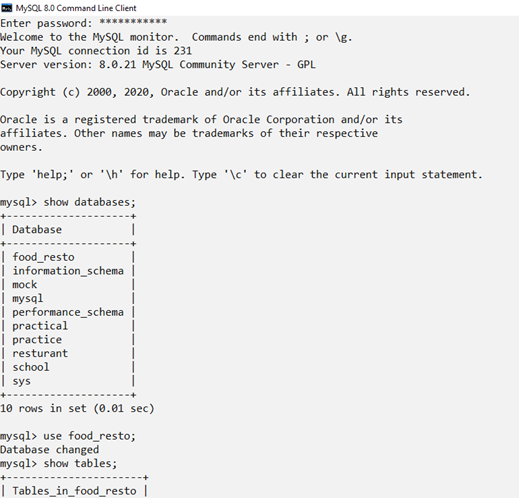

# Resturant-Management-System
## INTRODUCTION

This project “Food Restaurant System” is developed in Python, which is one of the object oriented language that could be the most powerful link to future programming methodologies. 

The source code is based on the simple ‘Food Ordering system’ program implementing Python language. In this project customers are provided with various options like Registration, Food menu, placing your order, Editing and Deleting your order. The customers can get themselves registered, they can order from a variety of cuisines from the food menu as provided by the restaurant. Customers can also make changes in their order or they can also cancel the order as they wish.

## AIM

The aim of the project is to create a program using Python titled “Food Restaurant System” and to connect it with SQL. Our software provides an easy user interface which enables the user to register, view the food menu, placing the order, and making changes in the food order. This program helps in making the system more sophisticated and user friendly and also in saving the precious time.

This project is ventured to represent the management facilities in the present and the future world. In this system you can order your food without getting in contact with person who is selling it. In this project we mainly concentrate on the connectivity of python with SQL, to make databases and tables using python which can be displayed in SQL and also to minimize the errors while handling the system.

## OUTPUT
### SQL

### INTERFACE

  

